# FamiliLook Crew — Visual Workflows

> Open this file in VS Code (built-in Mermaid preview) or paste into https://mermaid.live
> Zero cost, zero plugins needed in VS Code 2026+

---

## 1. Organisation Chart

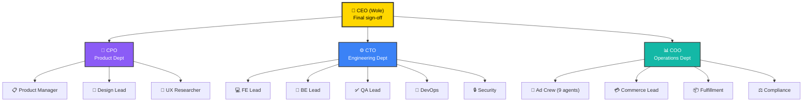

---

## 2. Task Flow: How Work Gets Assigned

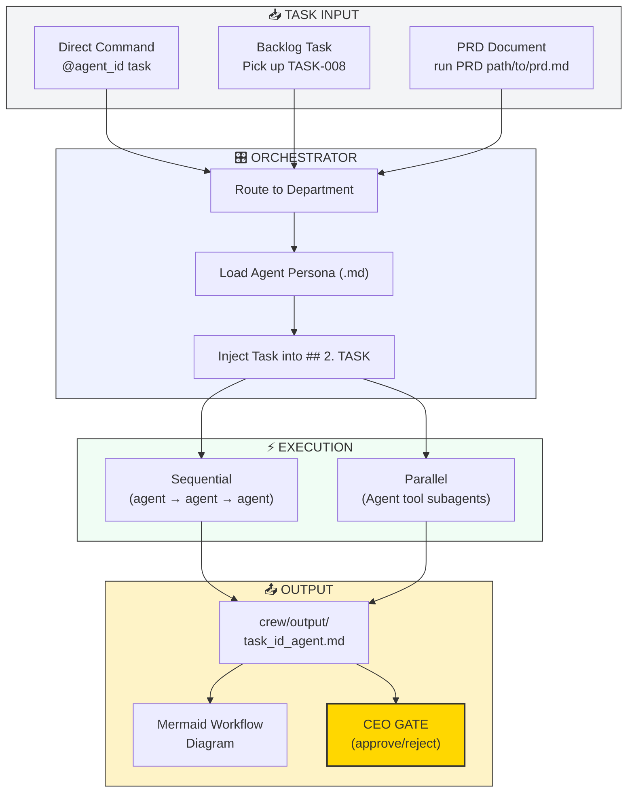

---

## 3. Feature Development Workflow (11 Steps)

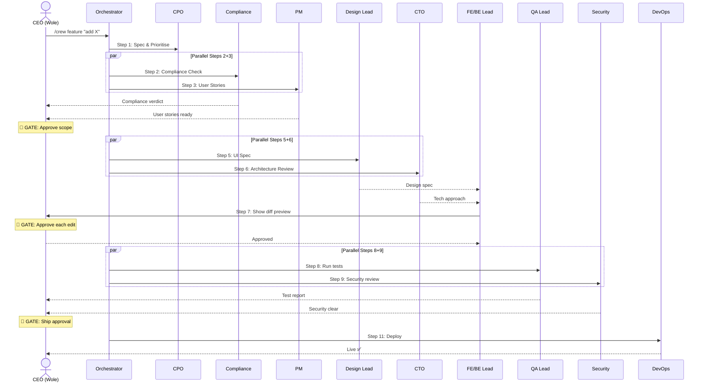

---

## 4. Bug Fix Workflow

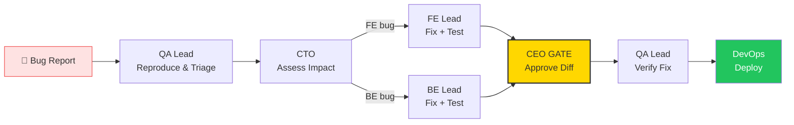

---

## 5. Sprint Planning Workflow

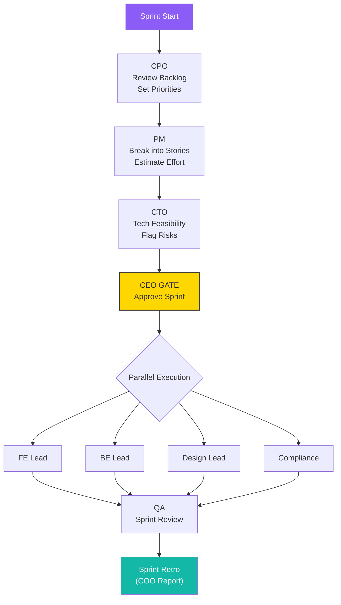

---

## 6. Deployment Workflow

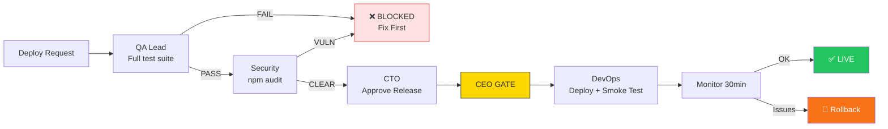

---

## 7. Incident Response Workflow

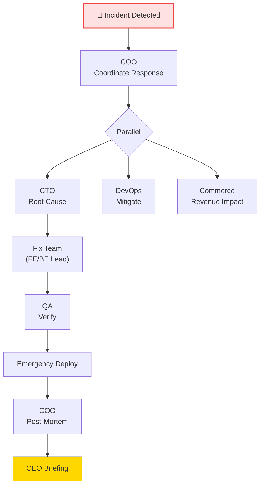

---

## 8. Marketing Campaign Workflow

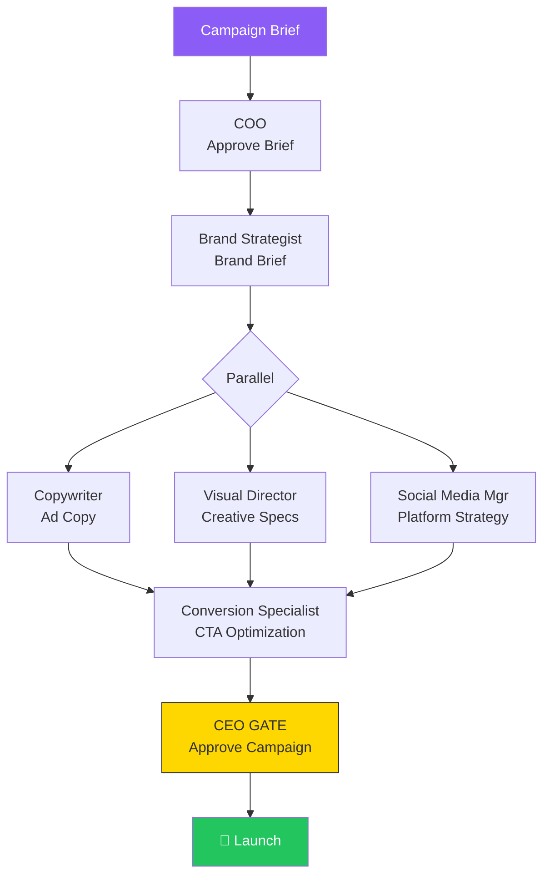

---

## 9. Product Backlog Status

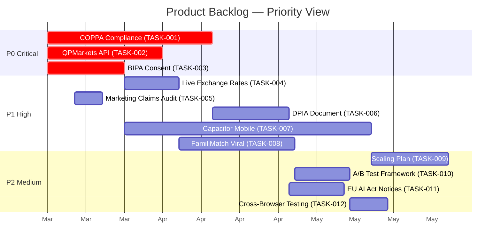

---

## 10. Agent Interaction Matrix — Who Talks To Whom

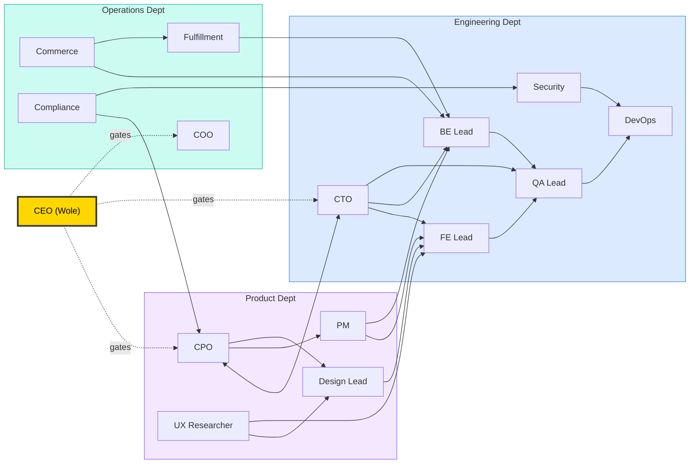

---

## 11. Sprint 1 — FamiliTrail Agent Collaboration

Shows which agents collaborate on each FamiliTrail task and handoff points.

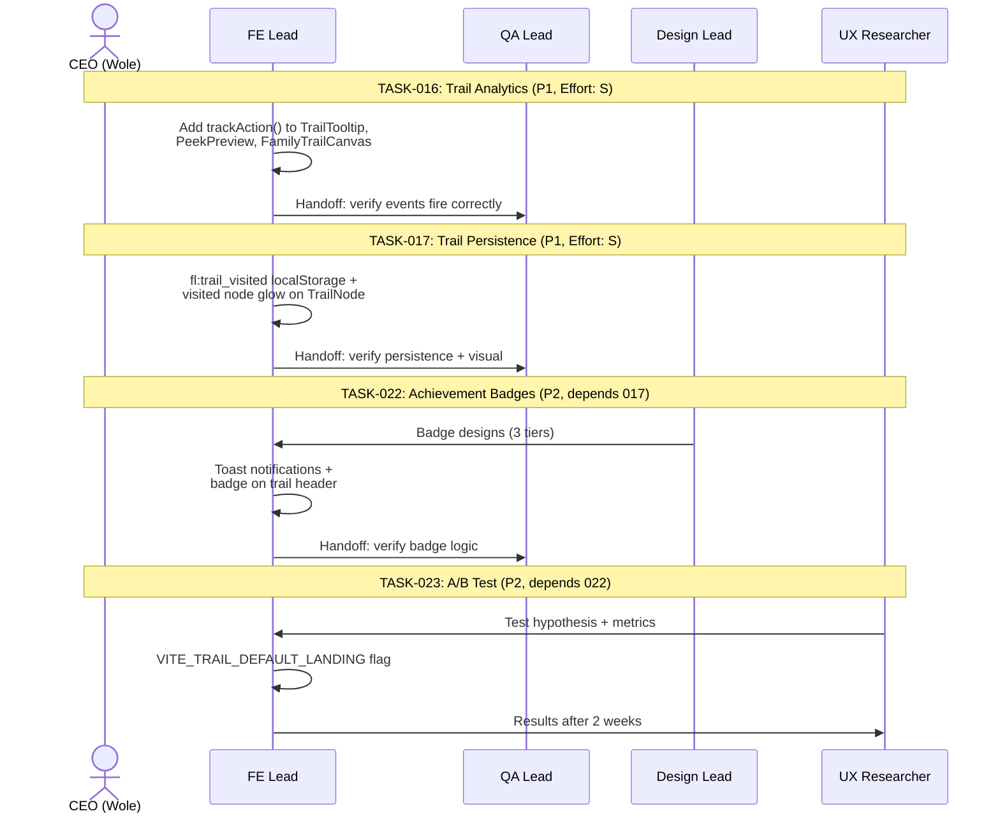

---

## 12. Sprint 1 — FamiliVault Agent Collaboration

Shows the multi-agent workflow for VaultCard consolidation and downstream tasks.

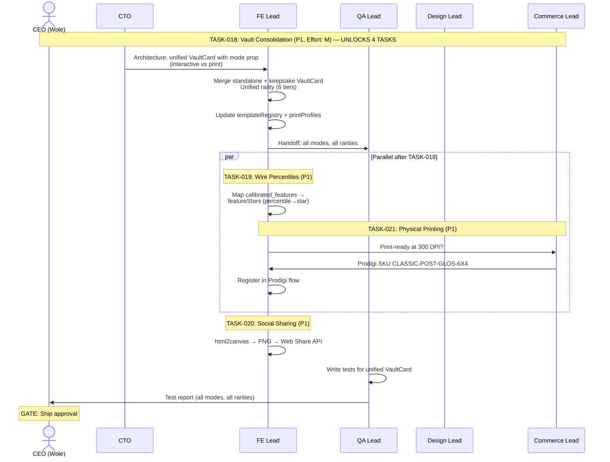

---

## 13. Task Dependency Graph — Agent Ownership

Visual map of task dependencies colour-coded by owning agent.

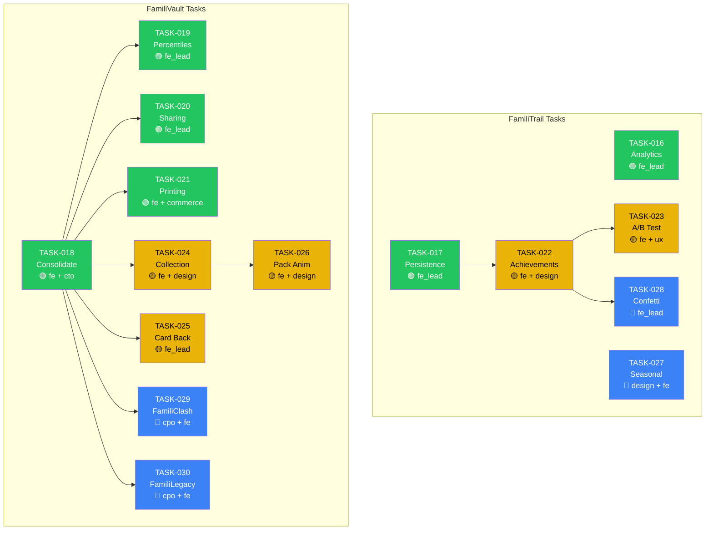

Legend: Green = P1 (this sprint), Yellow = P2 (next sprint), Blue = P3 (future)

---

## 14. Agent Communication Patterns

How artifacts flow between agents during execution.

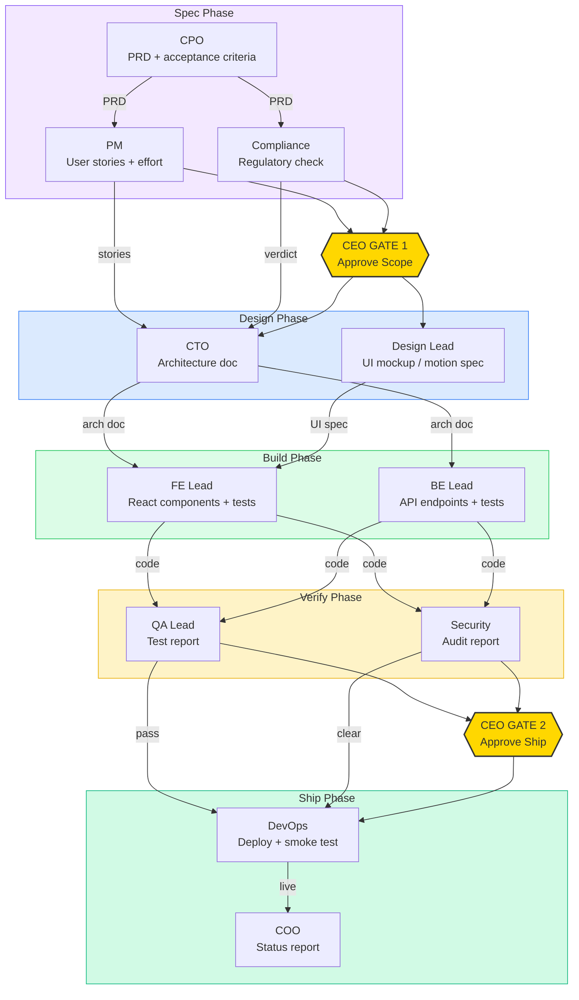

---

## 15. Three Crew Systems — How They Interoperate

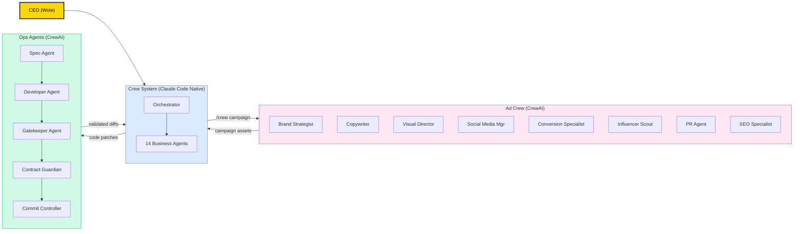

---

## 16. Current Sprint Gantt — Agent Assignments

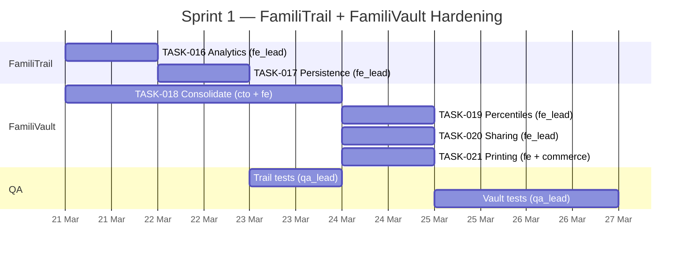

---

## How to View These Diagrams

1. **VS Code** (recommended): Open this file — Mermaid renders in the built-in markdown preview (Ctrl+Shift+V)
2. **Mermaid Live**: Copy any `mermaid` block to https://mermaid.live
3. **GitHub**: Push this file — GitHub renders Mermaid natively in markdown
4. **Export**: Use Mermaid CLI (`mmdc`) to export as PNG/SVG/PDF
