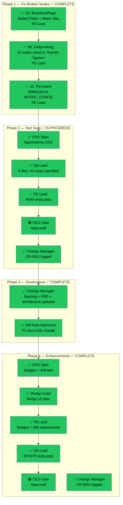
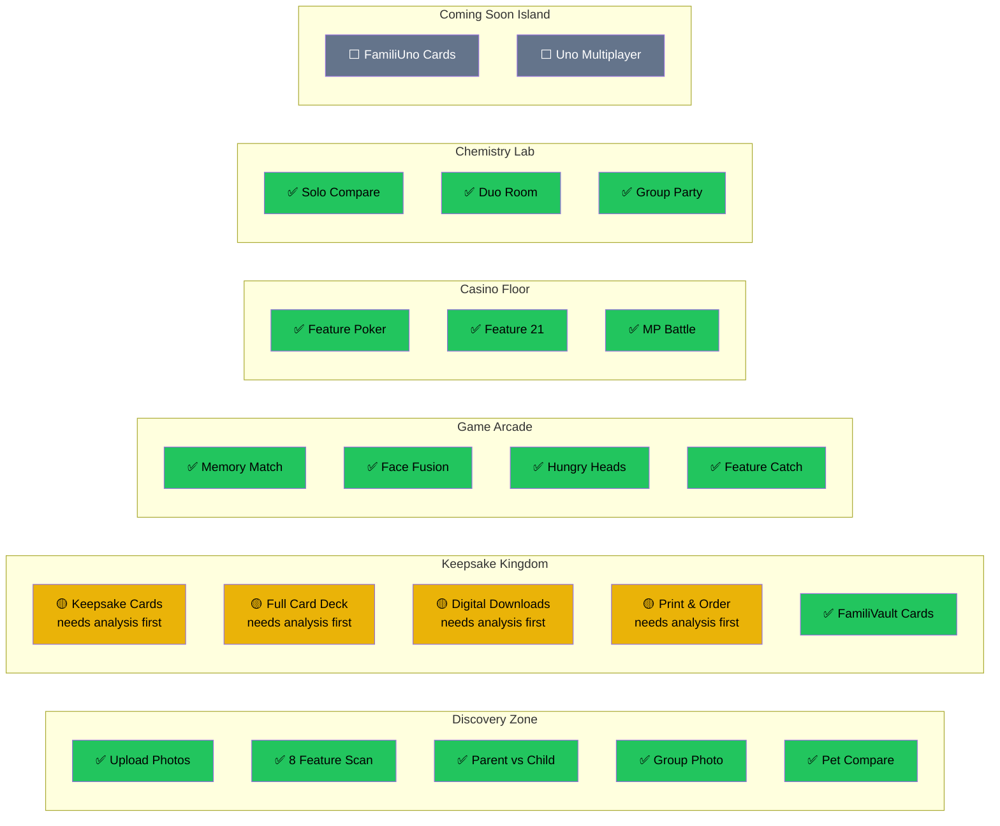

# Crew Workflow Progress — Live Tracker

> Open in VS Code (built-in Mermaid preview) or paste into https://mermaid.live
> Updated by Change Manager after each crew execution

---

## Current Task: FamiliTrail Test Coverage & Governance

**Command**: `/crew feature "FamiliTrail — 22 nodes governed and tested"`
**Started**: 2026-03-23
**Status**: IN PROGRESS

---

### Workflow Progress

---

### Trail Node Health Matrix

---

### Agent Activity Log

| Timestamp | Agent | Action | Artifact | Status |
|-----------|-------|--------|----------|--------|
| 2026-03-23 08:30 | FE Lead | Phase 1A: Added Poker+Match tiles to BrandHubPage | BrandHubPage.jsx, vite.config.mjs | ✅ Done |
| 2026-03-23 08:45 | FE Lead | Phase 1B: Deep-linked 10 trail nodes | trailData.js, TrailTooltip.jsx, UploadSection.jsx, CardGame.jsx | ✅ Done |
| 2026-03-23 09:00 | FE Lead | Phase 1C: Added pet intent config | IntentSelector.jsx | ✅ Done |
| 2026-03-23 09:15 | CPO | Phase 2: Spec for trail test coverage | trail_tests_cpo_spec.md | ✅ Done |
| 2026-03-23 09:16 | CEO | Gate: Approved CPO spec | — | 🟢 Approved |
| 2026-03-23 09:17 | QA Lead | Phase 2: Test specifications (6 files, 55 cases) | trail_tests_qa_spec.md | ✅ Done |
| 2026-03-23 09:30 | FE Lead | Phase 2: Implemented 6 test files (44 cases) | tests/trail/*.test.{js,jsx} | ✅ Done |
| 2026-03-23 09:35 | FE Lead | Fixed vitest.config.ts — added react plugin for JSX | vitest.config.ts | ✅ Done |
| 2026-03-23 09:40 | CEO | Gate: Approved test coverage (44 cases, 967 total) | — | 🟢 Approved |
| 2026-03-23 09:41 | Change Manager | Phase 2: CR-0001 logged, change_log updated, artifacts verified | trail_phase1_2_change_request.md | ✅ Done |

---

### Legend

| Symbol | Meaning |
|--------|---------|
| ✅ | Complete — tested, verified |
| 🔵 | In Progress — agent working |
| 🟡 | Working but limited (by design) |
| ⬜ | Pending — not yet started |
| 🔴 | Blocked |
| 🟢 | CEO Gate — approved |
| 🔲 | CEO Gate — awaiting |

---

> This file is updated by the Change Manager after each step.
> View in VS Code with Mermaid preview or paste sections into https://mermaid.live
